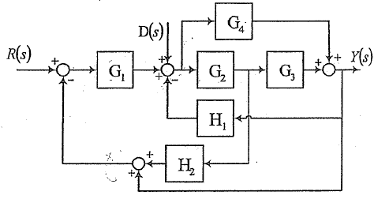
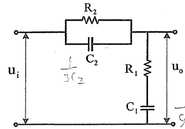
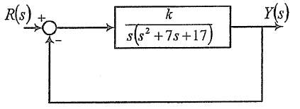

# 2018年-中国人民解放军国防科技大学-自动控制原理851

1. （20分）某系统框图如图所示，试求该系统在输入信号$R(s)$和干扰信号$D(s)$共同作用下的输出信号$Y(s)$。  

2. （10分）某电气系统如图所示，试求系统的传递函数$G(s)=u_o(s)/u_i(s)$。  

3. （20分）某系统框图如图所示。  
  
    1. 试确定使系统产生持续等幅振荡的参数k的取值和相应的振荡角频率；
    2. 若要求闭环系统所有极点均位于$s=-1$垂线的左侧，试确定参数k的取值。